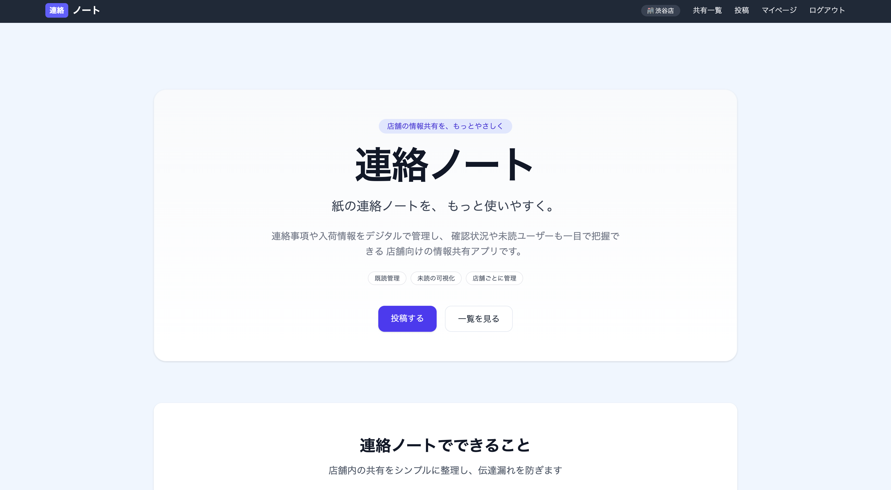
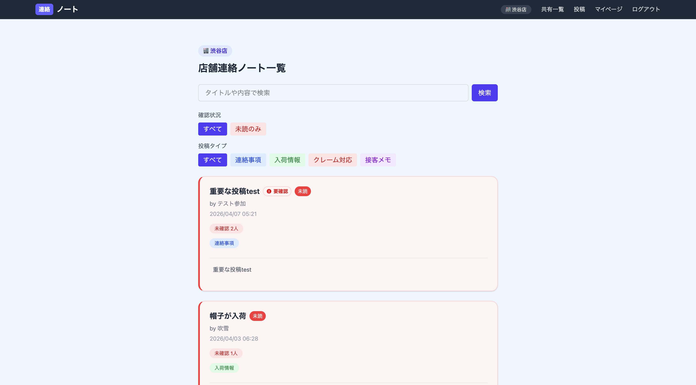
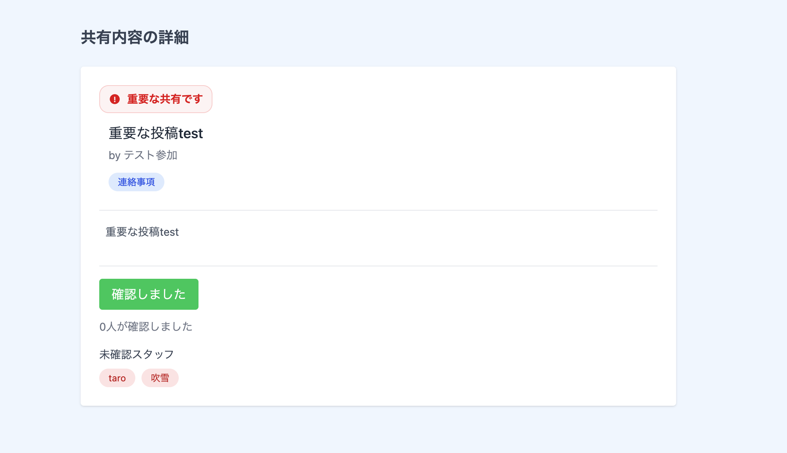
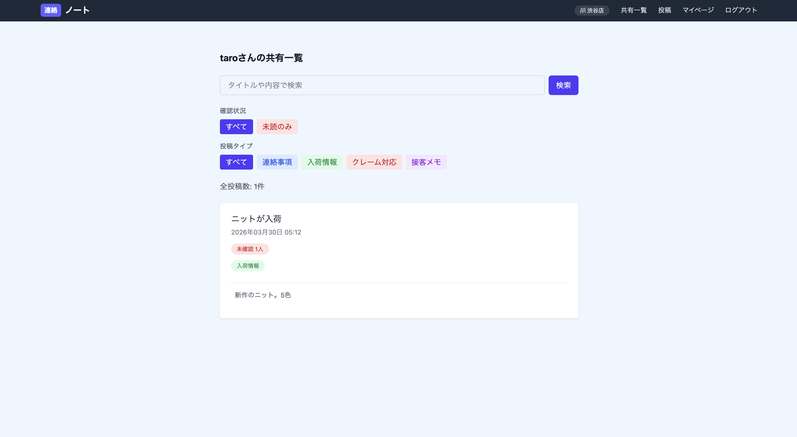

# StoreLog（ストアログ）

アパレル店舗向け情報共有アプリ

---

## 📝 概要

StoreLogは、アパレル店舗向けの情報共有アプリです。

紙の連絡ノートで発生する

* 誰が読んだかわからない
* 情報を探しにくい
* 確認漏れが発生する

といった課題を解決するために開発しました。

既読管理・未読可視化・店舗ごとのデータ分離により、店舗内の情報共有を効率化します。

---

## 🌐 公開URL

https://storelog-app.onrender.com/

---

## 🎯 作成背景

私はアパレル販売員として約8年間勤務していました。

店舗では紙の連絡ノートを利用していましたが、

* 読んだかどうかが曖昧
* 情報を探すのに時間がかかる
* LINEでは休日にも通知が届いてしまう
* ミス共有が個人攻撃のように感じられる場合がある

といった課題がありました。

実際の現場で感じた課題を解決するため、StoreLogを開発しました。

---

## ✨ アプリの特徴

* 🏬 店舗単位でデータを分離（他店舗の情報は閲覧不可）
* 👀 既読管理により「誰が確認したか」を可視化
* 🚨 未読ユーザーの可視化で確認漏れを防止
* 🔍 キーワード検索・絞り込み機能
* 📱 シンプルなUIで現場でも使いやすい設計

---

## ⚙️ 主な機能

### 🏬 店舗管理

* 新規登録時はデフォルト店舗へ自動所属
* 店舗コードを入力して既存店舗へ参加
* 店舗ごとのデータ分離
* ユーザーと投稿を店舗単位で管理

### 📢 投稿機能

* 連絡事項
* 入荷情報
* クレーム対応
* 接客メモ

を投稿可能

### 👀 既読機能

* 投稿ごとに「確認しました」ボタン
* 誰が確認したかを可視化

### 🚨 未読管理

* 未読ユーザー一覧表示
* 未読投稿のみ表示

### 🔍 検索・フィルタ機能

* キーワード検索
* 投稿タイプ別絞り込み
* 未読のみ表示

### 👤 ユーザー管理

* ユーザーごとの投稿管理
* マイページ機能

---

## 🧪 デモデータ（ローカル確認用）

面接やポートフォリオ確認時に、店舗分離・既読管理・重要投稿・店舗コード参加機能を確認しやすいように、デモ用seedデータを用意しています。

ローカル環境では、以下のコマンドでデモデータを作成できます。

```bash
docker compose exec web bin/rails db:seed
```

作成される主なデータは以下です。

* デモ店舗：3件
* デモユーザー：5件
* デモ投稿：8件
* デモ既読：5件

デモログイン情報：

* [demo.shibuya.staff@example.com](mailto:demo.shibuya.staff@example.com) / password
* [demo.shinjuku.staff@example.com](mailto:demo.shinjuku.staff@example.com) / password
* [demo.join@example.com](mailto:demo.join@example.com) / password

店舗参加機能を確認する場合は、`demo.join@example.com` でログイン後、店舗設定画面で店舗コード `DEMO-SHIBUYA` を入力します。

デモseedは本番環境では実行されないようにガードしています。
固定パスワードのデモユーザーを本番環境に作成しないため、このデータはローカル確認用です。

---

## 💡 工夫した点

### 店舗ごとのデータ分離

ユーザー・投稿を店舗単位で紐付けることで、他店舗の情報を閲覧できない設計にしました。
また、既読登録時もログインユーザーの所属店舗に紐づく投稿のみを対象としています。
別店舗の投稿IDを直接指定した場合は既読登録できないようにし、店舗ごとのデータ分離をより安全にしています。
投稿詳細・編集・更新・削除、ユーザー詳細についても、ログインユーザーの所属店舗に紐づくデータのみを取得しています。
別店舗のIDを直接指定した場合は404となり、閲覧や変更ができないようにしています。

### 店舗コードによる店舗参加

ログインユーザーは、店舗設定画面で店舗コードを入力することで既存店舗へ参加できます。
入力した店舗コードに一致する店舗がない場合は、現在の所属店舗を変更せずエラーを表示します。

店舗を変更しても、過去の投稿は投稿時点の店舗に残る設計です。
また、ユーザーページでは現在所属している店舗の投稿のみを表示し、元の店舗に残した投稿が移動先の店舗に表示されないようにしています。

### 既読管理機能

Readモデルを利用した中間テーブルを作成し、ユーザーと投稿の既読状態を管理しています。

### パフォーマンス改善

N+1問題を防ぐため、includesを利用して関連データを事前読み込みしています。

### テスト

RSpecを導入し、主要機能のテストを実装しています。

既読登録のrequest specでは、以下の動作を確認しています。

* 同じ店舗の投稿には既読登録できる
* 別店舗の投稿には既読登録できない
* 同じ投稿を二度確認しても既読が重複しない
* 未ログイン時は既読登録できない

投稿・ユーザー画面のrequest specでは、以下の店舗分離を確認しています。

* 同じ店舗の投稿詳細とユーザーページは閲覧できる
* 自分が作成した同じ店舗の投稿は編集画面を閲覧できる
* 別店舗の投稿詳細・編集画面・ユーザーページは閲覧できない
* 別店舗の投稿は更新・削除できない
* 更新・削除リクエスト後も、対象の投稿データが変更されていない

店舗参加機能のrequest specでは、以下の動作を確認しています。

* 未ログインでは店舗設定画面にアクセスできない
* ログインユーザーは店舗設定画面を表示できる
* 正しい店舗コードで所属店舗を変更できる
* 存在しない店舗コードでは所属店舗が変更されない
* 店舗変更後も過去の投稿の所属店舗は変わらない
* 店舗移動後のユーザーページには元店舗の投稿が表示されない
* 現在所属している店舗の投稿のみ表示される

テスト実行結果：

* 85 examples
* 0 failures

---

## 🛠 使用技術

### Backend

* Ruby 3.3.10
* Ruby on Rails 7.1.6

### Frontend

* Tailwind CSS
* ERB

### Database

* PostgreSQL
* Neon

### Authentication

* Devise

### Infrastructure

* Docker
* Render

### Test

* RSpec
* FactoryBot

---

## 🚀 今後の改善

* 店舗作成機能の追加
* 通知機能（任意ON/OFF）
* シフト管理機能
* スマホUIの最適化
* iOSアプリ化


---

## 📸 画面イメージ
### トップページ



### 共有一覧



### 共有詳細



### マイページ


